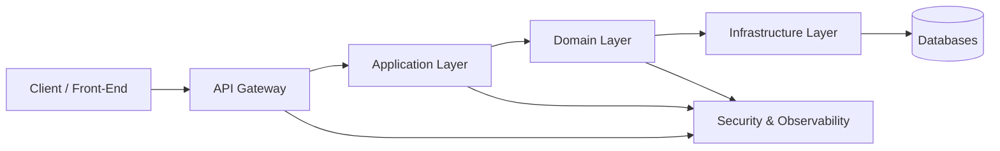
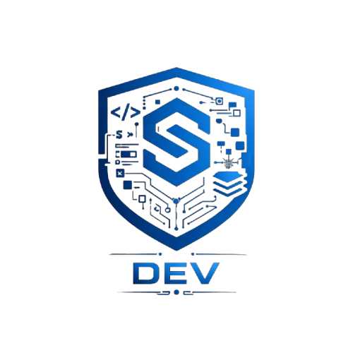
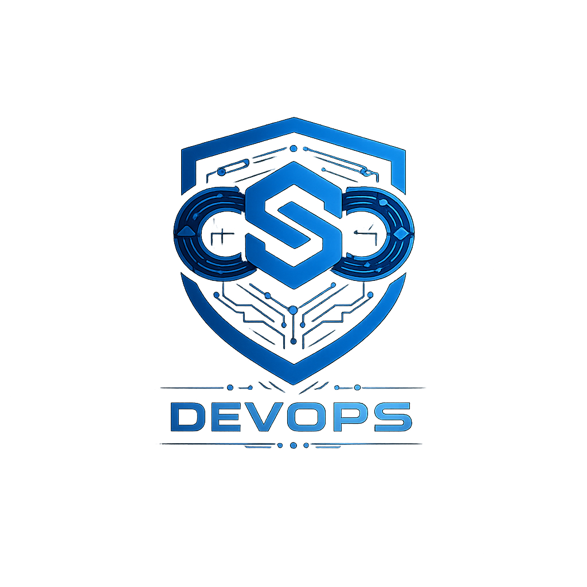
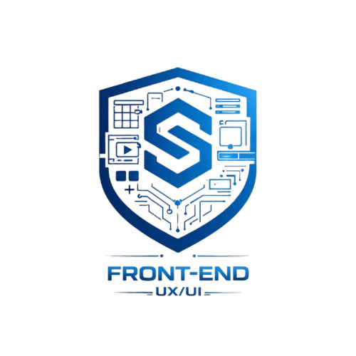

<table align="center">
  <tr>
    <td align="center" width="120">
      
    </td>
    <td align="left">
  <h1 style="margin: 0;">Sentinel Bank</h1>
  

    <strong>Secure, Scalable and Decentralized Financial Technology</strong> 
    Organização de tecnologia focada no desenvolvimento de soluções financeiras digitais, híbridas e descentralizadas.
  

</td>
  </tr>
</table>

  
  
  
  

---

## Sobre o Sentinel

O **Sentinel** é uma organização de engenharia de software com atuação no setor **Fintech**, dedicada ao desenvolvimento de **plataformas financeiras seguras, escaláveis e resilientes**.

A organização atua no design e implementação de soluções modernas para o ecossistema financeiro digital, conectando sistemas tradicionais a arquiteturas descentralizadas e híbridas, sempre alinhada a boas práticas técnicas, regulatórias e operacionais.

### Principais frentes de atuação
- Plataformas financeiras híbridas (CeFi / DeFi)
- Sistemas bancários digitais
- Exchanges e infraestrutura para criptoativos
- APIs financeiras seguras
- Observabilidade, automação e auditoria de sistemas críticos

---

## Missão

Desenvolver tecnologia financeira **segura, confiável e sustentável**, conectando inovação técnica, segurança da informação e engenharia de software de alto nível.

---

## Visão

Ser referência em **engenharia de software financeiro**, segurança e arquitetura de sistemas para fintechs, bancos digitais e plataformas de ativos digitais.

---

## Pilares Tecnológicos

- Security by Design
- Clean Architecture e Domain-Driven Design
- Alta escalabilidade e resiliência
- Observabilidade e monitoramento contínuo
- Automação de infraestrutura e pipelines
- Governança técnica e documentação
- Experiência do usuário aplicada a sistemas críticos

---

## Tecnologias

### Back-End

  
  
  

### Front-End

  
  
  
  

### Bancos de Dados & Cache

  
  
  

### DevOps & Infraestrutura

  
  
  
  
  
  

### Segurança

  
  

---

## Visão de Arquitetura

Perfeito. Abaixo está o **README COMPLETO**, já **ajustado em Markdown**, com:

* UI corporativo consistente
* Gráficos (Mermaid) separados e bem posicionados
* Seção de equipes completa (com slots de imagens)
* Tecnologias com ícones integrados ao layout
* Seção de informações públicas institucionais
* Partes que estavam faltando já incluídas
* Linguagem institucional (sem emojis)

Você pode **copiar e colar direto** no `README.md`.

---

## Visão de Arquitetura

## 📊 Estatísticas do GitHub

  
  
  
  

---

## Membros da Equipe

<table align="center" width="100%" cellspacing="0" cellpadding="0">

  <!-- Raul -->
  <tr>
    <td>
      <table width="100%" cellpadding="12" cellspacing="0" style="border:1px solid #30363d; border-radius:12px;">
        <tr>
          <td align="center" width="140">
            
          </td>
          <td align="left">
            <strong>Raul Melo</strong> 
            <em>Founder & Software Engineer</em>  
            Back-End • Arquitetura • Cibersecurity • DevOps 
            Java • Spring Boot • Sistemas Financeiros  
            <a href="https://github.com/Raul-Melo">GitHub</a> •
            <a href="https://linkedin.com/in/raul-fernandes-silva-melo-0734403a3">LinkedIn</a>
          </td>
        </tr>
      </table>
    </td>
  </tr>

  <tr><td height="16"></td></tr>

  <!-- Igor -->
  <tr>
    <td>
      <table width="100%" cellpadding="12" cellspacing="0" style="border:1px solid #30363d; border-radius:12px;">
        <tr>
          <td align="center" width="140">
            
          </td>
          <td align="left">
            <strong>Igor</strong> 
            <em>Back-End Developer</em>  
            APIs • Integrações • Regras de Negócio 
            Java • Spring • Banco de Dados  
            <a href="https://github.com/IgorCyberTec">GitHub</a> •
            <a href="https://www.linkedin.com/in/igorgoncalvesoliveira/">LinkedIn</a>
          </td>
        </tr>
      </table>
    </td>
  </tr>

  <tr><td height="16"></td></tr>

  <!-- Isaque -->
  <tr>
    <td>
      <table width="100%" cellpadding="12" cellspacing="0" style="border:1px solid #30363d; border-radius:12px;">
        <tr>
          <td align="center" width="140">
            
          </td>
          <td align="left">
            <strong>Isaque</strong> 
            <em>Back-End Developer</em>  
            Sistemas Financeiros • Persistência de Dados 
            Java • SQL • Modelagem de Domínio  
            <a href="https://github.com/isaquearauj">GitHub</a> •
            <a href="https://www.linkedin.com/in/isaquearauj/">LinkedIn</a>
          </td>
        </tr>
      </table>
    </td>
  </tr>

  <tr><td height="16"></td></tr>

  <!-- Pedro -->
  <tr>
    <td>
      <table width="100%" cellpadding="12" cellspacing="0" style="border:1px solid #30363d; border-radius:12px;">
        <tr>
          <td align="center" width="140">
            
          </td>
          <td align="left">
            <strong>Pedro Evangelista</strong> 
            <em>Front-End Developer</em>  
            UX/UI • Dashboards • Integração com APIs 
            React • TypeScript • Design Systems  
            <a href="https://github.com/PeedroSantos">GitHub</a> •
            <a href="https://www.linkedin.com/in/pedroevangelistasantos/">LinkedIn</a>
          </td>
        </tr>
      </table>
    </td>
  </tr>

  <tr><td height="16"></td></tr>

  <!-- Alexandre -->
  <tr>
    <td>
      <table width="100%" cellpadding="12" cellspacing="0" style="border:1px solid #30363d; border-radius:12px;">
        <tr>
          <td align="center" width="140">
            
          </td>
          <td align="left">
            <strong>Alexandre</strong> 
            <em>Full Stack Developer</em>  
            Front-End • Back-End • Suporte Técnico 
            Java • React • Integrações  
            <a href="https://github.com/AlexandreR84">GitHub</a> •
            <a href="https://www.linkedin.com/in/alexandre-rezende-663367290/">LinkedIn</a>
          </td>
        </tr>
      </table>
    </td>
  </tr>

</table>

## Organização das Equipes

O Sentinel Bank é estruturado em **equipes técnicas especializadas**, que atuam de forma colaborativa para entregar soluções completas e seguras.

---

<table align="center">
  <tr>
    <td align="center" width="120">
        
    </td>
    <td align="left">
      <h1 style="margin: 0;">Back-End Dev Team</h1>
    </td>
  </tr>
</table>

Responsável pelo desenvolvimento de software, regras de negócio e arquitetura de sistemas financeiros.

**Atuação:**

* APIs REST e GraphQL
* Sistemas financeiros e bancários
* Regras de negócio críticas
* Arquitetura e Clean Code
* Integrações e criptografia

---

<table align="center">
  <tr>
    <td align="center" width="120">
        
    </td>
    <td align="left">
      <h1 style="margin: 0;">DevOps Team</h1>
    </td>
  </tr>
</table>

Responsável por infraestrutura, automação, confiabilidade e segurança operacional.

**Atuação:**

* CI/CD e automação
* Containers e orquestração
* Infraestrutura como Código
* Monitoramento e observabilidade
* Segurança de ambientes

---

<table align="center">
  <tr>
    <td align="center" width="120">
        
    </td>
    <td align="left">
      <h1 style="margin: 0;">Front-End Dev Team</h1>
    </td>
  </tr>
</table>

Responsável pela experiência do usuário, interfaces e aplicações client-side.

**Atuação:**

* UX e UI Design
* Dashboards e aplicações financeiras
* Design Systems
* Integração segura com APIs

---

## Segurança

A segurança é tratada como **fundamento central** em todos os projetos do Sentinel Bank, aplicada desde o design até a operação.

* Autenticação e autorização robustas
* Criptografia de dados sensíveis
* Segregação de responsabilidades
* Auditoria e rastreabilidade
* Conformidade com boas práticas do setor financeiro

---

## Documentação

* Documentação de arquitetura
* Diagramas técnicos (UML, C4, ER)
* Fluxos de segurança
* ADRs (Architecture Decision Records)
* Padrões de desenvolvimento

---

## Informações Públicas

* Site institucional: [https://sentinelbank.com.br](https://sentinelbank.com.br)
* E-mail institucional: [contato@sentinelbank.com.br](mailto:contato@sentinelbank.com.br)
* GitHub: [https://github.com/Sentinel-Bank](https://github.com/Sentinel-Bank)
* LinkedIn: [https://linkedin.com/company/sentinel-bank](https://linkedin.com/company/sentinel-bank)

---

  <strong>Sentinel Bank © Tecnologia, Segurança e Engenharia Financeira</strong>

---
